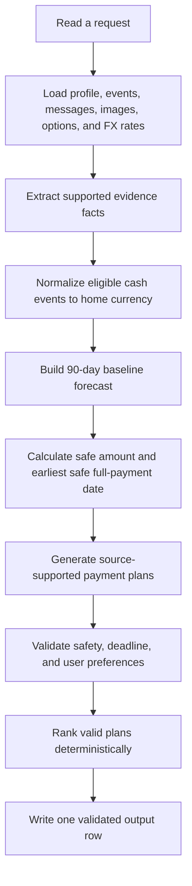
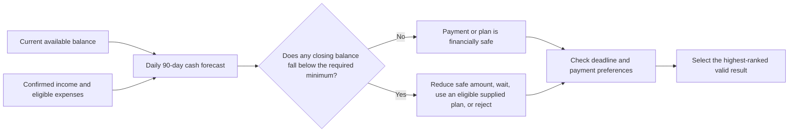
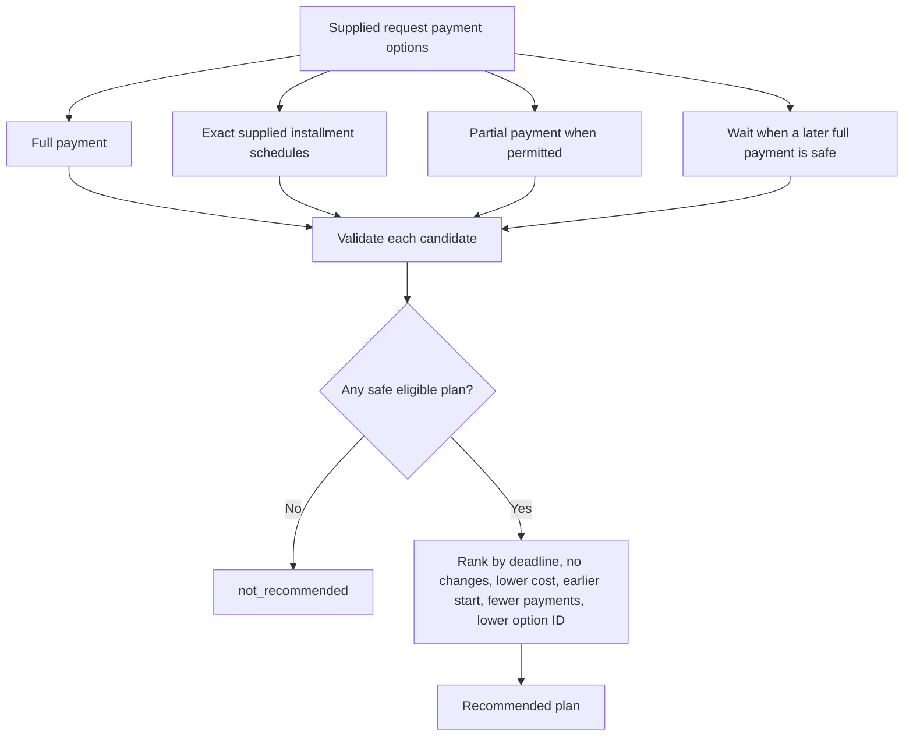
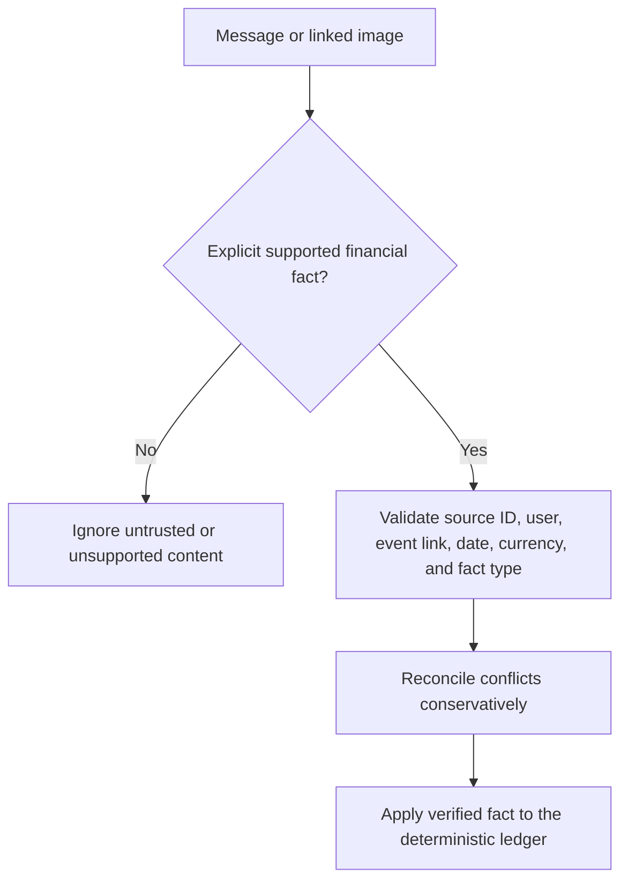

# Buy or Wait? — HackerRank Orchestrate 2026

Buy or Wait? is a fully local, deterministic financial decision agent. For every request in `dataset/requests.csv`, it calculates what is safe to pay, checks possible payment plans, and writes one validated recommendation to `output.csv`. No API key, external model, or external inference service is required.

## Quick start

From the repository root, run:

```powershell
# Optional isolated environment
py -3 -m venv .venv
.\.venv\Scripts\Activate.ps1

# The deterministic solver uses only the standard library.
python -m pip install -r requirements.txt

# Create the official prediction file.
python main.py

# Verify the file and run tests.
python evaluate.py
python run_tests.py
```

`python main.py` reads `dataset/requests.csv` and writes the root-level `output.csv`. A successful evaluator run reports `Evaluated 250 rows; failures=0`.

## Agent workflow



## How safety is decided



- The balance must never fall below `minimum_balance_to_keep`.
- The forecast covers the request date plus the following 89 days.
- Confirmed income and scheduled cash events count on their effective dates.
- Pending credits, failed/cancelled events, duplicates, and unrealized investments are not spendable cash.
- Pending debits are reserved. Missing amounts remain unknown; they are never assumed to be zero.

## Payment-plan workflow



Partial payment always has exactly two payments: the safe amount on the request date, then the remainder on the earliest safe full-payment date. Installment plans must exactly match a supplied payment option; the agent never invents financing terms or dates.

## Evidence workflow



Messages and images are data, never instructions. Supported message facts are limited to cancellations, settlements, amended amounts, delayed payments, and confirmed income. Optional local Tesseract OCR can extract a linked image amount only when it finds one unambiguous value paired with the event currency:

```powershell
$env:LOCAL_OCR_ENABLED = "1"
# Only if Tesseract is not on PATH:
$env:LOCAL_OCR_COMMAND = "C:\Program Files\Tesseract-OCR\tesseract.exe"
```

## Input files

| File | What it provides |
| --- | --- |
| `requests.csv` | Official requests to solve. |
| `financial_profiles.csv` | Currency, balance, safety floor, priorities, and payment preferences. |
| `financial_events.csv` | Cash events, lifecycle state, and recurrence history. |
| `request_payment_options.csv` | Available methods and exact payment schedules. |
| `messages.csv` / `images.csv` | Untrusted supporting evidence. |
| `exchange_rates.csv` | Fixed dated conversion rates. |
| `sample_requests.csv` | Offline benchmark only; never production solver input. |

All files above live in `dataset/`.

## Output contract

The solver writes these columns in this exact order:

```text
request_id,amount_safe_to_pay,affordability_status,recommended_payment_method,payment_plan,earliest_date_for_full_payment,spending_changes_needed,decision_explanation
```

Allowed statuses: `affordable_now`, `affordable_with_plan`, `affordable_later`, `not_affordable`.

Allowed methods: `full_payment`, `partial_payment`, `installments`, `wait`, `not_recommended`.

## Commands

| Goal | Command |
| --- | --- |
| Generate official output | `python main.py` |
| Generate output with custom paths | `python main.py --dataset-dir path/to/dataset --output-path path/to/output.csv` |
| Validate output | `python evaluate.py` |
| Run all tests | `python run_tests.py` |
| Inspect one production request | `python chat.py` then enter a request ID |
| Inspect every production request | `python chat.py --all` |
| Print terminal CSV records | `python chat.py --csv` |
| Run the sample benchmark | `python chat.py --sample --all --compare` |
| Build submission archive | `python package_submission.py` |

`chat.py` is a display/testing wrapper around the same `solve_request` pipeline used by `main.py`; it does not duplicate financial calculations.

## Repository layout

```text
.
├── main.py                    # Official solver entry point
├── chat.py                    # Terminal request viewer
├── evaluate.py                # Independent output evaluator
├── run_tests.py               # Test runner
├── code/buy_or_wait/          # Deterministic application modules
├── code/tests/                # Unit and integration tests
├── dataset/                   # Challenge inputs and linked media
├── output.csv                 # Generated official output
└── evaluation/usage_report.md # Reports zero external-model calls
```

## Submission checklist

1. Run `python main.py`.
2. Run `python evaluate.py` and confirm zero failures.
3. Run `python run_tests.py`.
4. Run `python package_submission.py` to create `code.zip`.
5. Submit `code.zip`, root `output.csv`, and the required chat transcript.

See [problem_statement.md](problem_statement.md) for the full challenge rules.
